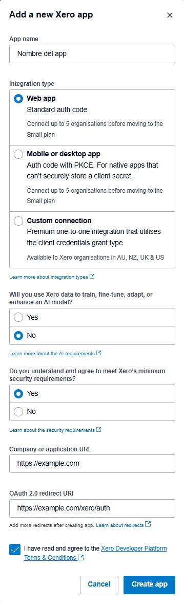
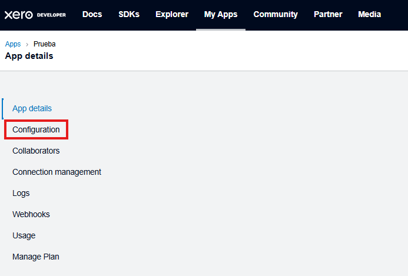
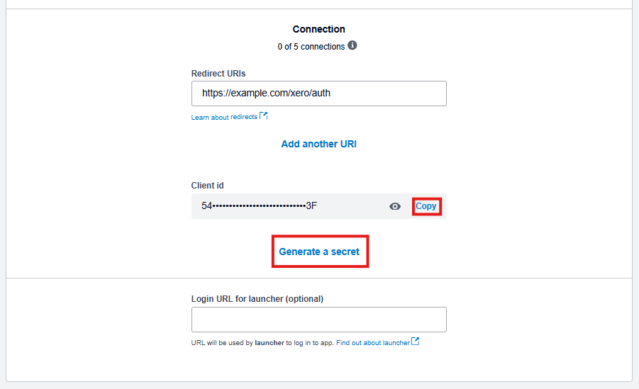
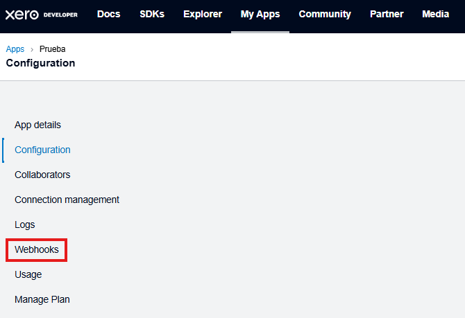
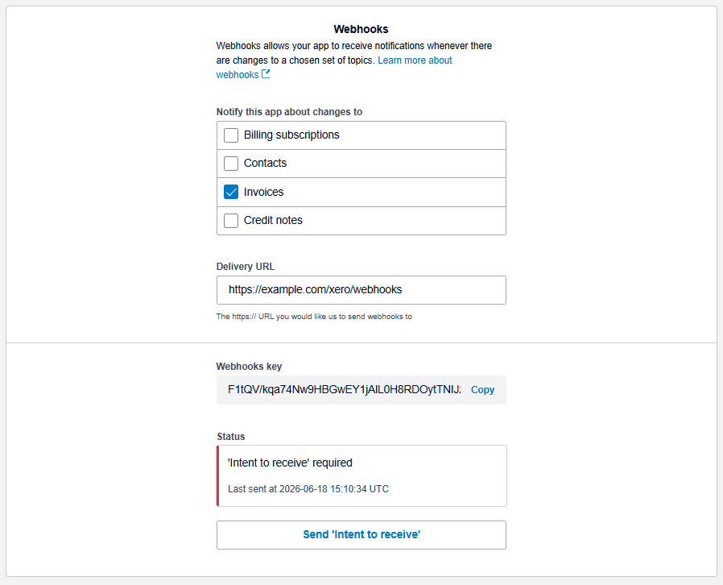

# Pasos de instalación
## 1. Instalar la versión apropiada de Python
Navega al [sitio web de Python](https://www.python.org/downloads/) y descarga la versión más reciente de Python 3.13. Es posible usar gestores de entornos virtuales como Conda, pero
eso no se va a tratar aquí por temas de simplicidad.
> [!IMPORTANT]
> Este proyecto ha sido validado únicamente en Python 3.13. Es posible que funcione en versionas más recientes o más antiguas, pero no podemos garantizarlo con certeza.

## 2. Instalar las dependencias
### Con `requirements.txt`
En el directorio base del proyecto, se puede encontrar un archivo llamado `requirements.txt`. Este archivo es una lista de todas las dependencias que usa el código. Sabiendo esto, se pueden ejecutar alguno de los siguientes comandos para llevar a cabo este proceso:
```
pip install -r requirements.txt
```
Para Windows:
```
py -m pip install -r requirements.txt
```
> [!TIP]
> Anotar las nuevas dependencias en `requirements.txt` mientras se continúa con el desarrollo del proyecto facilita la instalación de estas para futuros usuarios.

### Manualmente
A continuación, se incluyen los nombres de los paquetes de las dependencias para que puedan ser instaladas de forma manual con `pip`, el administrador de paquetes de Python:
* [`authlib`](https://docs.authlib.org/en/stable/)
* [`"fastapi[standard]"`](https://fastapi.tiangolo.com/)
* [`furo`](https://furo.readthedocs.io/)
* [`httpx`](https://www.python-httpx.org/)
* [`itsdangerous`](https://itsdangerous.palletsprojects.com/en/stable/)
* [`myst-parser`](https://itsdangerous.palletsprojects.com/en/stable/)
* [`pydantic-settings`](https://pydantic.dev/docs/validation/latest/get-started/)
* [`python-dotenv`](https://pypi.org/project/python-dotenv/)
* [`sphinx`](https://pypi.org/project/python-dotenv/)
* [`sphinx-autodoc2`](https://pypi.org/project/python-dotenv/)
* [`zeep`](https://pypi.org/project/python-dotenv/)

## 3. Crear una aplicación en Xero

Para los pasos posteriores, se ocupan varios datos suministrados por Xero al crear una aplicación. Sigue las siguientes instrucciones:
1. Ve a [*My Apps*](https://developer.xero.com/app/manage) en Xero Developer e inicia sesión
2. Crea una nueva app e ingresa los datos solicitados. Cambia `https://example.com` por el URL de tu servidor.

    

3. Selecciona la nueva aplicación en la lista y navega a la pestaña de *Configuration*.

    

4. Navega al fondo de la página. Guarda el *Client ID* y haz clic en *Generate a Secret*. Seguidamente, guarda el *Client Secret* en algún lugar seguro.

    

5. Navega a la pestaña de *Webhooks*.

    

6. En *Webhooks*, copia la configuración mostrada y copia el *Webhooks key* que será generada.

    

> [!NOTE]
> Recuerda hacer clic en *Send 'Intent to receive'* una vez el servidor esté funcionando. Esto le permite a Xero verificar que el servidor está en funcionamiento para comenzar a mandarle notificaciones.

## 4. Configurar el servidor
El servidor necesita una variedad de variables de entorno almacenadas en un archivo `.env`. Este se puede configurar automáticamente con una guía interactiva ejecutable con el siguiente comando:
```
python -m servidor.configurar
```
Para Windows:
```
py -m servidor.configurar
```

### Crear el archivo `.env`
Se te va a preguntar lo siguiente:
```
¿Deseas configurar los parámetros opcionales? s/N
> 
```
> [!NOTE]
> Se recomienda omitir por completo las variables opcionales. Escribe N y presiona Enter.

A continuación, se te pedirá que ingreses el valor de cada una de las variables. Se puede encontrar más información sobre estas en la documentación de [secretos._Entorno](secretos._Entorno). Un ejemplo de una de estas solicitudes es:
```
Introduce un valor para ID_CLIENTE_XERO
> 
```
Escribe el valor apropiado para la variable y presiona Enter. Una vez termines, podrás ver que se ha creado un archivo `.env`.
> [!TIP]
> Puedes cambiar la configuración en cualquier momento editando a `.env` manualmente. No se pueden añadir variables no contempladas dentro de [secretos._Entorno](secretos._Entorno) porque, en caso contrario, se producirá un error en el código.